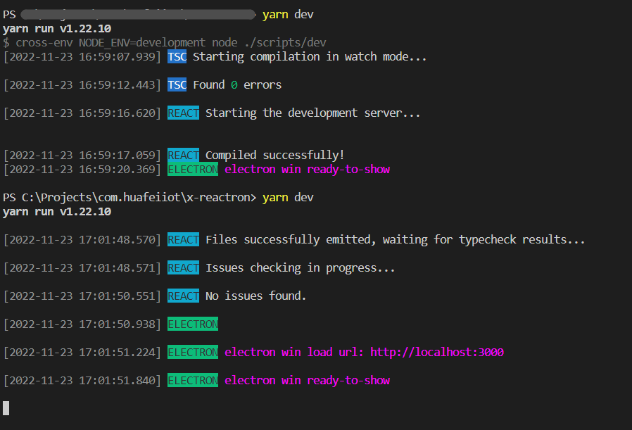
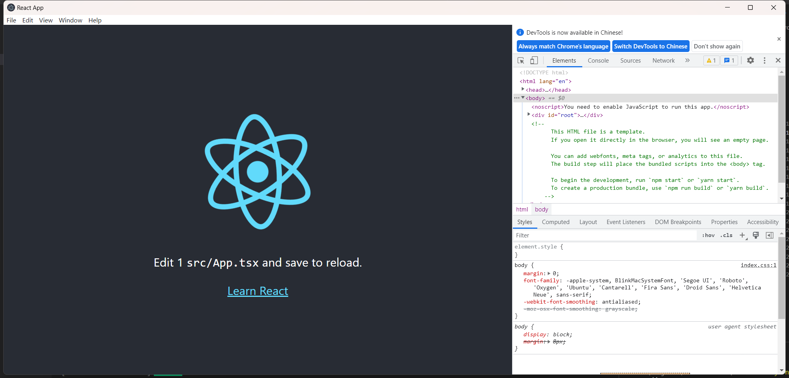

# X-REACTRON

## 介绍
React + Electron 脚手架

一行命令同时运行tsc --watch, webpack-dev-server、electron
  
*通过自定义脚本的方式，使用子进程方法，将tsc --watch模式、create-react-app的webpack-dev-server模式，及electron运行时用一个进程管理起来，并针对自己的需求进行一些处理，提升开发体验。*

---
## 目录
基于create-react-app的目录结构：
* 新增scripts目录，自定义脚本代码在此目录，语言为JavaScript，免tsc编译；
* 新增electron目录，electron代码将在此目录中，支持热更新（简单逻辑: 代码发生变化后，重新启动electron）；
---

## 安装
```bash
git clone https://github.com/xiongjiajun/x-reactron
```
---

## CLI

### 开发 dev
```bash
npm run dev # yarn dev
```
<div>输出如下:</div>


<div>运行效果:</div>



<br/>

---

### 构建 build
TODO ...

---
### 预览 start
TODO ...

---
### 发布 release
TODO ...
